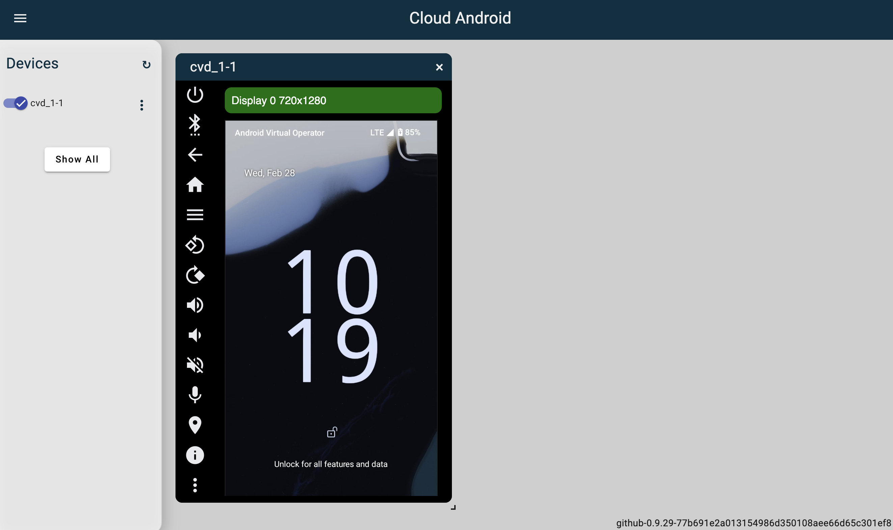

### Local dev is hard(ware constrained)

This step of the process could have taken me 2 hours, but instead took me days of fiddling to figure out. There were a few hard fought lessons throughout the process. Let's get those out of the way.

[**Hardware Requirements:**](https://source.android.com/docs/setup/start/requirements)

- 64gb of memory
  - anything less than this will give OOM errors (yes, I tried)
- 300gb of storage
  - the Android source takes up almost all of this
- 6 core processor
  - in the build step, you can parallelize the make command using `make -j(num_cores)`

**OS Requirement: Linux**

I'll briefly layout what I tried to get this to run locally on my Mac, but spoiler alert, none of these worked. If you're able to get this to run locally on a Mac machine, please send me an email, and I'll update this post.

1. Run Linux in a Docker container
   - Despite my M2 Mac's high-end hardware, the build basically stalled out after building for over 24 hours
2. Dual booting Linux
   - On an old (2019 I think) MacBook pro with an i9 Intel chip, I tried to dual boot Ubuntu
     - The later Intel-based Macs have a T2 chip with increased security features + drivers that are incompatible with Ubuntu
       - The combination of the new OS + the chipset bricked my Mac until I reinstalled MacOS and repartitioned my hard drive
3. Parallel's desktop app (somewhat successful)
   - If you have a physical test device, this might be a viable solution
     - Was able to get the AOSP source code built
   - If you are testing on an emulator:
     - Don't even try this on Apple silicon chips
       - Nested virtualization is required after building AOSP to run an Android emulator (likely Cuttlefish), and the M-series Macs do not support this
     - On Intel-based Mac, I was able to get Cuttlefish running
       - Computer was resource constrained (especially within the VM), and the emulator wouldn't fully boot

### Giving up (move to cloud)

After spending way too much time and bricking my MacBook, I decided to throw in the towel and set up a GCP VM.

I initialized an image with the following gcloud command:

```
gcloud compute images create nested-virt \
  --source-image-project=ubuntu-os-cloud \
  --source-image-family=ubuntu-2204-lts \
  --licenses="https://www.googleapis.com/compute/v1/projects/vm-options/global/licenses/enable-vmx"
```

This image is what enables the nested virtualization. You can see "enable-vmx" in the url path. If you go to GCC Compute Engine, under storage, you'll see Images. You can use this "nested-virt" image we just created to create a new VM.

As noted earlier, you're going to want at least 64 gigabytes of RAM and probably a 6 core CPU. I went with 96 gigabytes of RAM, an 8 core Intel Skylake CPU, and a 500 gigabyte SSD. With this setup, it took ~5 hours to build the AOSP source code.

### Building the AOSP source code

Make a clean directory (probably called 'aosp') in a drive that has at least ~300gb partioned.

Google uses a tool called "Repo" which is built on top of Git. You can install Repo by running `sudo apt-get install repo`.

We use repo to initialize our AOSP folder like so: `repo init -u https://android.googlesource.com/platform/manifest`. This will ask you to enter or create git credentials for the repo.

You can now run `repo sync -j[num_cores]` to download the AOSP source code. Depending on your bandwidth, this can take awhile; expect over an hour.

Now that you have the source code from the official AOSP repo, you need to build it.

Make sure that you're in the directory you just ran the sync command from, and run `source build/envsetup.sh`. This will set up the environment variables for the build.

The AOSP build system has a tooled called "Lunch" for picking the target hardware that you're building the source against. To see the entire "lunch menu", you can run the command `lunch`. This will show you all of the possible targets. The easiest to get running for most will be the target for the cuttlefish emulator; we'll talk more about this later.

To target the cuttlefish emulator running from your computer, you will want to run `lunch aosp_cf_x86_64_phone-trunk_staging-userdebug`. All that's left now is to run the make command. The build system aliases the make command to just the letter m. So you can run `m -j[num_cores]` to build the source code. The -j flag is optional (just like in the sync command), but it will parallelize the build process across your CPU's cores.

If you're interested in learning more about the AOSP build system, I would recommend [this conference talk by Chris Simmonds](https://youtu.be/hQZz2PRNdxI?si=wWeaJf_hOH2eyPgQ).

### Emulating with Cuttlefish

Cuttlefish is a lightweight emulator specifically for testing AOSP and custom implementations of it. Your AOSP source modifications should behave on physical phones the same way they do on Cuttlefish.

As mentioned previously, Cuttlefish requires nested virtualization to be enabled on your CPU in order to run. You can check if nested virtualization is enabled by running the following command: `grep -c -w "vmx\|svm" /proc/cpuinfo`. If this returns a non-zero value, it means that nested virtualization is enabled and you're good to go. However, if it returns zero, you likely need to enable nested virtualization in your BIOS if your CPU supports it.

To install Cuttlefish, you need to run the following commands:

```
sudo apt install -y git devscripts config-package-dev debhelper-compat golang curl
git clone https://github.com/google/android-cuttlefish
cd android-cuttlefish
for dir in base frontend; do
  cd $dir
  debuild -i -us -uc -b -d
  cd ..
done
sudo dpkg -i ./cuttlefish-base_*_*64.deb || sudo apt-get install -f
sudo dpkg -i ./cuttlefish-user_*_*64.deb || sudo apt-get install -f
sudo usermod -aG kvm,cvdnetwork,render $USER
sudo reboot
```

Note the `sudo usermod -aG kvm,cvdnetwork,render $USER` command. Specifically, we're adding the user to the KVM group, enabling the modification and usage of the Kernel-based Virtual Machine which is what we had to enable in the previous step.

Once your machine has finished rebooting, navigate back to the AOSP source folder you created, enter `source build/envsetup.sh` into the command line followed by `lunch aosp_cf_x86_64_phone-trunk_staging-userdebug`. Now you're back to where you started, except now, you have Cuttlefish installed. To start the recently installed cuttlefish emulator, run `launch_cvd`.

Cuttlefish runs on port 8443. If you're running this on the cloud, you're going to need to port-forward this endpoint so you can see the emulated device visual. You can simply run: `ssh -L 8443:localhost:8443 <remote-server-address>` (assuming you want to use the 8443 port locally as well). You should now be able to see a screen that looks like this if you visit localhost:8443:



If you see this screen, it means you're ready to move on to writing an AOSP module that we can run on our new emulator. In the next post, we'll go over getting started with writing one in Rust.
