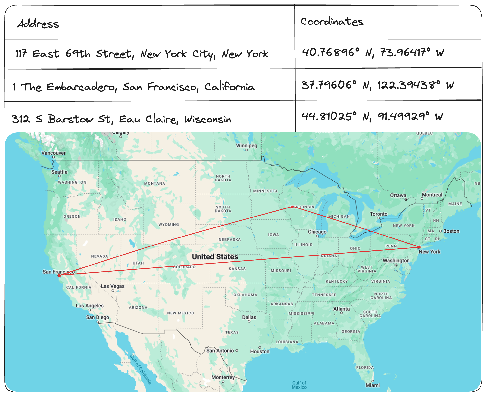

Spatial doesn't just mean 3D. Almost 9 years ago, my friend [Pasquale D'Silva](https://twitter.com/okpasquale) showed us examples of spatial interfaces in consumer mobile apps in [a blog post done with Elepath Exports](https://medium.com/elepath-exports/spatial-interfaces-886bccc5d1e9). However, with the release of the Oculus Quest, and more recently, the Apple Vision Pro, we've unlocked another dimension available to us physical beings: the third dimension. Simultaneously, the tech industry has been rapidly adopting a spatial-native data type: **embeddings**.

Embeddings are just a fancy name for vectors, and vectors are just a fancy name for lists of numbers. We've even created a new type of data store for this data, inuitively called a vector database. Here's an example you're surely familiar with:
 In this example, Google Maps is a vector database that stores a 2 dimensional vectors (coordinates) for each address in the United States.

In this case, the model that maps addresses to coordinates is manually generated by some government entity (likely the post office). However,
